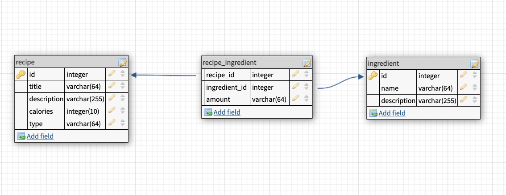

# Recipe API -- Find Recipe with Food or Calories

This was created during my time as a student at Code Chrysalis.


## Features

- Create Recipe & Ingredients Database with information in it. There is also a table to connect 2 tables together.
- Get Recipes with id Or Name
- Filter Recipe with calories or ingredients
- Create Recipe to your database
- Create Ingredient to your database

## Database Structure

Recipe & Ingredients Database, There is also a table to connect 2 tables together.


## API Endpoints

### Recipe

Recipes endpoint returning recipe items.

- `GET api/recipe/`
  Get all recipes from the database.

```JSON
{
    "id": 1,
    "title": "Egg Fried Rice",
    "description": "This is a description with some words."
},
{
    "id": 2,
    "title": "Omlet",
    "description": "This is a description with some words."
}
```

- `GET api/recipe/{id Or name}`
  Get recipe by id or name

```JSON
{
    "id": 5,
    "title": "Thai Fried Rice",
    "description": "Thai Traditional Fried Rice.",
    "calories": 1300,
    "type": "Lunch",
    "ingredients": [
        "Rice",
        "Thai Herb Mixture"
    ]
}
```

- `GET api/recipe?limit={number}`
  Get first x recipes with limitations.

```JSON
{
    "id": 1,
    "title": "Egg Fried Rice",
    "description": "This is a description with some words."
},
{
    "id": 2,
    "title": "Omlet",
    "description": "This is a description with some words."
}
```

- `GET api/recipe?calories={"lt": number, "gt": number}`
  Get recipes between calories' range.
  (lt = less than, gt = greater than)

```JSON
[
  "Recipe with calories less than 2000 and greater than 400:",
  [
      {
          "id": 1,
          "userID": 140,
          "title": "Egg Fried rice",
          "description": "This is a description with some words. Lorem Ipsum........",
          "calories": 750,
          "type": "Lunch"
      },
      {
          "id": 3,
          "userID": 142,
          "title": "Meatball Pasta",
          "description": "This is a description with some words. Lorem Ipsum........",
          "calories": 670,
          "type": "Dinner"
      }
  ]
]
```

- `GET api/recipe/ingredient/{ingredient name}`
  Get recipes with ingredient name.

```JSON
[
    [
    {
        "id": 1,
        "title": "Egg Fried Rice",
        "description": "This is a description with some words. Lorem Ipsum........",
        "calories": 750,
        "type": "Lunch",
        "ingredients": [
            "Egg"
        ]
    },
    {
        "id": 2,
        "title": "Omlet",
        "description": "This is a description with some words. Lorem Ipsum........",
        "calories": 300,
        "type": "Lunch",
        "ingredients": [
            "Egg"
        ]
    }
 ]
]
```

- `POST api/recipe/`

  Create a recipe. Please follow the JSON request format below:

```JSON
{
    "id": 1,
    "title": "Title String",
    "description": "Description String",
    "calories": 750,
    "type": "Breakfast"
}
```

- `POST api/recipe/{recipe id}/ingredient`

  Add an existing ingreident to a recipe.

```JSON
 {
    "ingredientID": 1, // This is Egg
    "amount": "100g" // This is a string
}
```

- `PATCH api/recipe/{recipe id}`
  Edit a recipe

```JSON
[
    "Recipe is updated!",
    "Recipe id: 10",
    {
        "userID": 777,
        "title": "Test Recipe",
        "description": "This is a test recipe",
        "calories": 777,
        "type": "Breakfast"
    }
]
```

- `DELETE api/recipe/{recipe id}`

Delete a recipe.

```JSON
[
    "Recipe is removed! id: 999",
]
```

### Ingredient

Ingredient endpoint to return ingredient objects.

- `GET api/ingredient/`

Get all ingredient from the database.

```JSON
[
  {
      "id": 1,
      "name": "Egg",
      "description": "Egg from local farm"
  },
  {
      "id": 2,
      "name": "Rice",
      "description": "Basic Rice"
  },
  {
      "id": 3,
      "name": "Pineapple",
      "description": "Fruits from can"
  }
]
```

- `POST api/ingredient/`

Create a recipe. Please follow the JSON request format below:

```JSON
{
  "id": 11,
  "name": "Sea Food Mixture",
  "description": "Easy to buy in a local super market"
}
```
